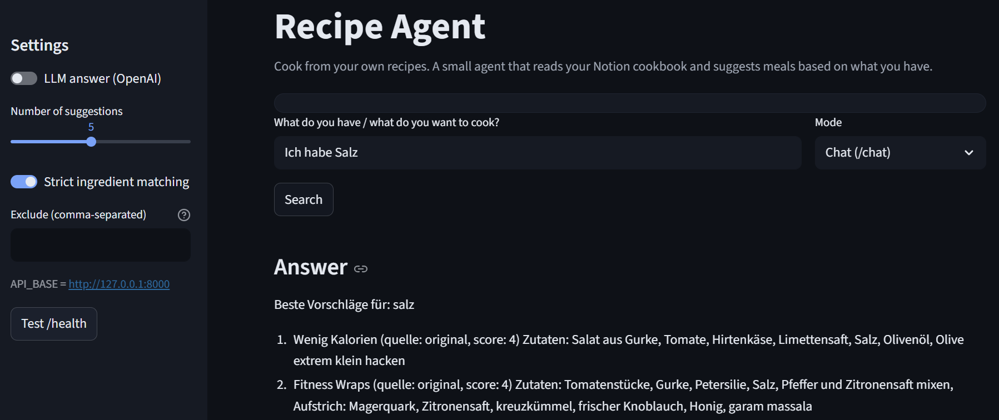
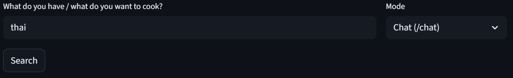
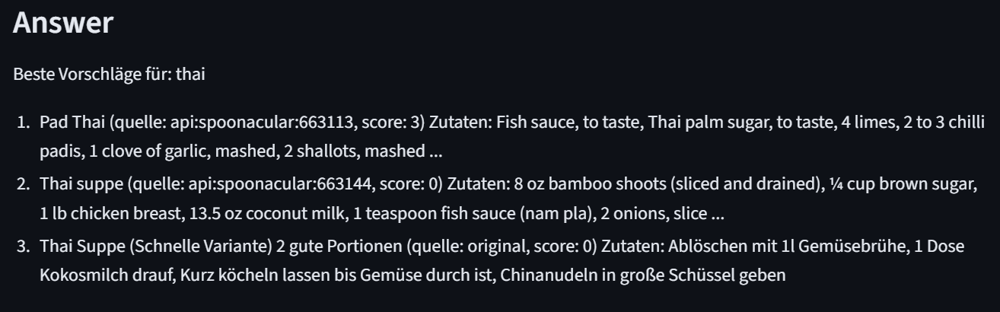
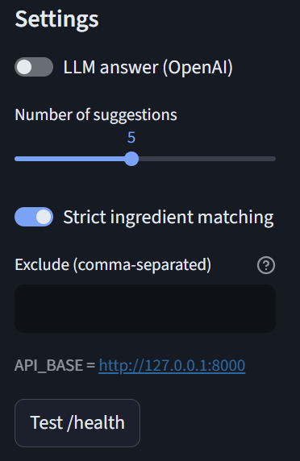

# Recipe Agent  
Agent for accessing and consulting my own recipes.

A live version of the web interface is available here:  
[https://recipeagent-brn4h8juawnvmvfkhq5ngg.streamlit.app/](https://recipeagent-brn4h8juawnvmvfkhq5ngg.streamlit.app/)

*(Please note: the app runs on the free Streamlit tier and may take a few minutes to start up after inactivity.)*

Everyone cooks differently. Over time, I’ve collected my own recipes — from my mom, grandma, friends, or things I’ve improvised myself — and stored them in a personal Notion page.  
That’s why searching the web or asking ChatGPT for recipes often doesn’t help: I don’t want random “internet recipes”, I want to use *my* recipes and *my* way of cooking.

**Recipe Agent** is a small project that connects directly to my Notion recipe collection and turns it into an intelligent personal cooking assistant.  
It can read, structure, and enrich my own recipes — and then help me decide what to cook based on the ingredients I have at home.

---

## Why and How It Works

### 1. Notion Integration – accessing my personal recipe collection
**Purpose:**  
All my recipes live in one long Notion page — some are detailed, some are just rough notes.  
The agent needs to read these directly from my workspace.

**Implementation:**  
A Notion API integration extracts each recipe, even if it’s unstructured or incomplete.  
The script parses paragraphs, dividers, and bullet points into structured objects with fields like `title`, `body`, `ingredients`, and `steps`.  
This forms the foundation of the agent’s “memory”.

---

### 2. Enrichment Pipeline – filling the gaps
**Purpose:**  
Many of my recipes only contain titles or a few lines.  
The goal is to automatically fill in missing parts like ingredients or cooking steps.

**Implementation:**  
Each recipe is checked for completeness using a simple text heuristic (number of lines, cooking terms, etc.).  
If the recipe is incomplete, the agent enriches it by querying the **Spoonacular API** or, as a fallback, an **OpenAI GPT-4** model.  
The enriched data (ingredients and steps) is cached locally in `enrichment_cache.json` for later reuse.

---

### 3. Recipe Agent Logic – reasoning about what to cook
**Purpose:**  
When I say something like:  
> “I have carrots and onions, what can I cook?”  
the agent should match that against my recipes and suggest the best options.

**Implementation:**  
This layer performs intent recognition and keyword matching between user input and the available recipes.  
It can also delegate to the **OpenAI GPT-4** API to generate natural-language responses.  
The result is a ranked list of recipes from my personal collection, enriched and structured for easy display.

---

### 4. FastAPI Backend – making it accessible
**Purpose:**  
To make the agent modular and testable, all logic is wrapped into a REST API.

**Implementation:**  
A lightweight **FastAPI** service exposes endpoints like `/chat` and `/plan`.  
It takes user messages as input, processes them through the agent pipeline, and returns structured JSON responses.  
The backend can run locally, in Docker, or on a cloud platform like Render.

---

### 5. Streamlit Frontend – a simple UI for interaction
**Purpose:**  
To interact with the system easily without the command line.

**Implementation:**  
A **Streamlit** app (`ui.py`) provides a minimal web interface with dark mode.  
It allows:
- Entering free-text recipe queries  
- Selecting the number of answers  
- Enabling or disabling GPT-4 for conversational reasoning (requires an OpenAI API key)  

The app communicates with the FastAPI backend in real time.

---

## Tutorial and Screenshots

### UI Overview
Clean dark-mode interface for searching and exploring personal recipes.



---

### Search Bar
Enter any query like  
> "I have carrots, onions, and rice."



---

### Results
Results can mix personal and enriched data:
- Two recipes enriched via the external API (in English)  
- One personal recipe retrieved directly from Notion (in German)



---

### Settings
Configure how the agent responds:
- Number of answers  
- Strict ingredient matching  
- GPT-4 activation for better reasoning and conversation  



---

## Architecture Overview

- `notion_api.py` – handles data access and parsing from Notion  
- `enrichment.py` – enriches incomplete recipes with missing ingredients or steps  
- `agent.py` – interprets natural-language queries and matches recipes  
- `app.py` – FastAPI backend exposing `/chat` and `/plan` endpoints  
- `ui.py` – Streamlit web interface  
- `.env` – environment configuration for API keys  

---

## Technologies

| Component | Tools |
|------------|--------|
| Backend | Python 3.12, FastAPI |
| Frontend | Streamlit |
| AI | OpenAI GPT-4 |
| APIs | Notion API, Spoonacular API |
| Infrastructure | Docker, Render |
| Utilities | dotenv, requests, uvicorn |

---

## Run Locally

```bash
# 1. Clone repository
git clone https://github.com/<yourname>/recipe-agent.git
cd recipe-agent

# 2. Create and activate virtual environment
python -m venv .venv
source .venv/bin/activate    # (Windows: .venv\Scripts\activate)

# 3. Install dependencies
pip install -r requirements.txt

# 4. Start backend
uvicorn apps.api.app:app --reload

# 5. Start frontend
streamlit run apps/ui/ui.py


